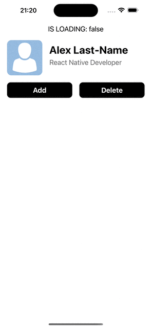

# react-native-auto-skeleton

**`react-native-auto-skeleton`** Provides automatic skeleton loading indicators based on your existing UI components, eliminating the need for manual placeholder configuration.

⚠️ **Currently supports only iOS with the New Architecture (Fabric). Android support is coming soon.**

## Demo
<p align="center">

</p>

## Installation

Using npm:
```bash
npm install react-native-auto-skeleton
```

Using yarn:
```bash
yarn add react-native-auto-skeleton
```

## Usage

Here's a quick example to get started:

```tsx
import { AutoSkeletonView } from 'react-native-auto-skeleton';

interface IProfile {
  name: string;
  jobTitle: string;
  avatar: string;
}

const getProfile = async (): Promise<IProfile> => {
  // Fetch profile data from your API
};

export default function App() {
  const [isLoading, setIsLoading] = useState(true);
  const [profile, setProfile] = useState<IProfile>({} as IProfile);

  useEffect(() => {
    (async () => {
      const res = await getProfile();
      setProfile(res);
      setIsLoading(false);
    })();
  }, []);

  return (
      <AutoSkeletonView isLoading={isLoading}>
        <View style={styles.avatarWithName}>
          <Image style={styles.avatar} source={{ uri: profile.avatar }} />
          <View style={{ flex: 1 }}>
            <Text style={styles.name}>{profile.name}</Text>
            <Text style={styles.jobTitle}>{profile.jobTitle}</Text>
          </View>
        </View>
        <View style={styles.buttons}>
          <TouchableOpacity style={styles.button}>
            <Text style={styles.buttonTitle}>Add</Text>
          </TouchableOpacity>
          <TouchableOpacity style={styles.button}>
            <Text style={styles.buttonTitle}>Delete</Text>
          </TouchableOpacity>
        </View>
      </AutoSkeletonView>
  );
}
```

## Best Practices

- For rapid implementation, wrap entire UI sections with `<AutoSkeletonView>`.
- For precise control, wrap individual UI components or groups separately.
- Ensure components have clearly defined dimensions, backgrounds, or styles for optimal skeleton rendering.

## License

[MIT](LICENSE)
